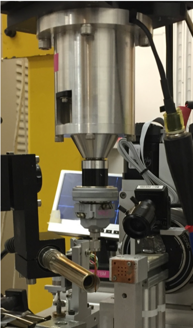

===========
EnviroCells
===========

The sample environments and their infrastructures are mostly dedicated to individual beamlines at the APS.  An overview of solutions for various in situ and operando applications is given here and will be continuously expanded _ :cite:`reference:01`.

Content
-------

.. toctree::
   :maxdepth: 1

   source/about
   source/environment
   source/infrastructure
   source/contribute
   source/reference

Contribute
----------

* Documentation: https://github.com/decarlof/envirocells/tree/master/
* Issue Tracker: https://github.com/decarlof/envirocells/issues
