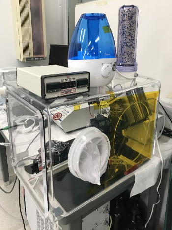
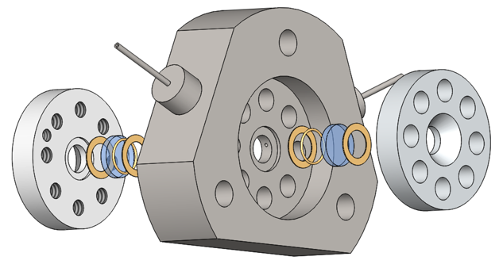

Interfaces
----------

+------------------+--------------+----------------+---------+-------------------------------------+-----------------------------------------------------------------------------------------+-------------------------+----------------------------+---------------------------+------+
|  Type            | Temp. Range  | Atmosphere     |  Image  | Commercial                          | Comment                                                                                 | Contact                 | Loan                       |  Info                     |      |
+------------------+--------------+----------------+---------+-------------------------------------+-----------------------------------------------------------------------------------------+-------------------------+----------------------------+---------------------------+------+
| MBE              | 30K to 1600K | UHV            | |00001| | No                                  | permanent setup in 33-ID                                                                | `Hawoong Hong`_         | No                         |  `box link 0001`_         |  1   |
+------------------+--------------+----------------+---------+-------------------------------------+-----------------------------------------------------------------------------------------+-------------------------+----------------------------+---------------------------+------+
| Humidity Chamber | 15 to 50 °C  | Air+ RH 10-95% | |00002| | Yes: `ETS model 5503`_              |                                                                                         | `Chris Benmore`_        | No                         |  `box link 0002`_         |  2   |
+------------------+--------------+----------------+---------+-------------------------------------+-----------------------------------------------------------------------------------------+-------------------------+----------------------------+---------------------------+------+
| Fluid-Solid Cell | up to 350 °C | No             | |00003| | No                                  |   high pressure up to 40 MPa                                                            | `Changyong Park`_       | Maybe, please ask          |  `box link 0003`_         |  3   |
+------------------+--------------+----------------+---------+-------------------------------------+-----------------------------------------------------------------------------------------+-------------------------+----------------------------+---------------------------+------+

.. _ETS model 5503: https://www.electrotechsystems.com/products/environmental-control/chambers/5503-compact-temperature-humidity-environmental-chambers-glove-boxes/

.. _box Link 0001: https://anl.box.com/s/p7g82gc7sgycgwi3ntxg0p8gez9x0m68
.. _box Link 0002: https://anl.box.com/s/mv9t68wn4kuyqq3mvy05mxc4zig9vt73
.. _box Link 0003: https://anl.box.com/s/wz9j41s8bmdx1l29l9cro2a27fwy82g9

 

.. |00001| image:: ../img/interfaces_01.jpg
    :width: 20pt
    :height: 20pt

.. _Hawoong Hong: mail to: hhong@anl.gov
.. _Chris Benmore: mail to: benmore@anl.gov
.. _Changyong Park: mail to: cypark@anl.gov

