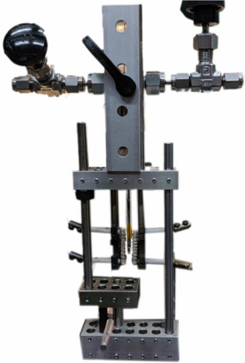
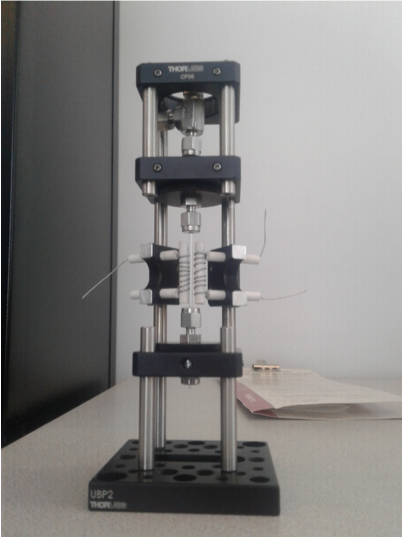
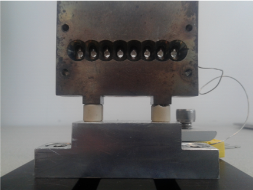
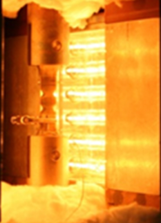
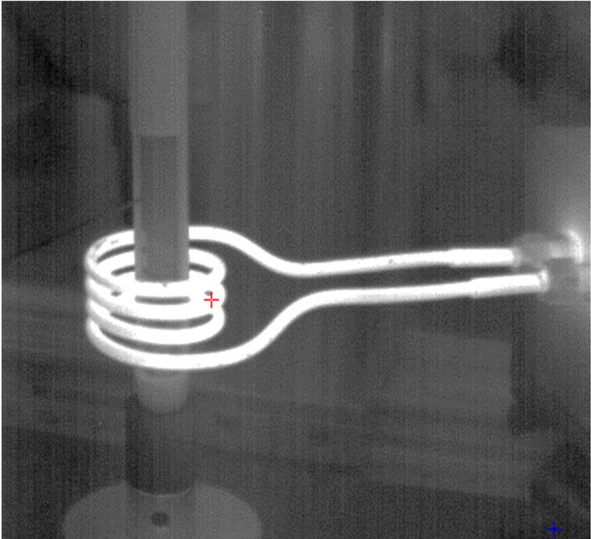

Interfaces
----------

+----------------+--------------+------------+---------+------------------------------------------------------------------------------------------------------------------------------+-------------------------+----------------------------+---------------------------+------+
|  Type          | Temp. Range  | Atmosphere |  Image  | Commercial                                                                                                                   | Contact                 | Loan                       |  Info                     |      |
+----------------+--------------+------------+---------+------------------------------------------------------------------------------------------------------------------------------+-------------------------+----------------------------+---------------------------+------+
| Blower         | up to 1000 °C| Helium     |         | No                                                                                                                           | `Peter Eng`_            | No                         |  Simple to build          |  1   |
+----------------+--------------+------------+---------+------------------------------------------------------------------------------------------------------------------------------+-------------------------+----------------------------+---------------------------+------+
| Blower         | up to 650 °C | Air        | |00002| | Yes: `Leister LE MINI`_                                                                                                      | `Wenqian Xu`_           | Ask                        |  `box link 0002`_         |  2   |
+----------------+--------------+------------+---------+------------------------------------------------------------------------------------------------------------------------------+-------------------------+----------------------------+---------------------------+------+
| Flow Cell      | up to 1000 °C| Yes        | |00003| | No                                                                                                                           | `Kevin Beyer`_          | Yes, if not in use         |  `box link 0003`_         |  3   |
+----------------+--------------+------------+---------+------------------------------------------------------------------------------------------------------------------------------+-------------------------+----------------------------+---------------------------+------+
| Flow Cell      | up to 1000 °C| Yes        | |00004| | No: made of commerical parts                                                                                                 | `Leighanne Gallington`_ | Yes, if not in use         |  `box link 0004`_         |  4   |
+----------------+--------------+------------+---------+------------------------------------------------------------------------------------------------------------------------------+-------------------------+----------------------------+---------------------------+------+
| Batch          | ~ 450 °C     | Air        | |00005| | No: NMR tubes as capillaries in a steel block                                                                                | `Leighanne Gallington`_ | Yes, if not in use         |  `box link 0005`_         |  5   |
+----------------+--------------+------------+---------+------------------------------------------------------------------------------------------------------------------------------+-------------------------+----------------------------+---------------------------+------+
| Flow Cell      | up to 1150 °C| Yes        |         | No: capillaries connected to gas system                                                                                      | `Matt Frith`_           | Yes, if not in use         |  Flow cell with spinner   |  6   |
+----------------+--------------+------------+---------+------------------------------------------------------------------------------------------------------------------------------+-------------------------+----------------------------+---------------------------+------+
| Infrared       | up to 1100 °C| Air        | |00007| | No: general purpose, bulk solid material                                                                                     | `Jun Sang Park`_        | bulky, difficult to move   |  `box link 0007`_         |  7   |
+----------------+--------------+------------+---------+------------------------------------------------------------------------------------------------------------------------------+-------------------------+----------------------------+---------------------------+------+
| Linkham TS1500 | up to 1300 °C| Yes        | |00008| | Yes: small solid material                                                                                                    | `John Okasinski`_       | Yes, if not in use         |  `box link 0008`_         |  8   |
+----------------+--------------+------------+---------+------------------------------------------------------------------------------------------------------------------------------+-------------------------+----------------------------+---------------------------+------+
| Induction      | up to 1500 °C| Air        | |00009| | No: very fast heater, conductive material                                                                                    | `Andrew Chuang`_        | Hard to move               |  `box link 0009`_         |  9   |
+----------------+--------------+------------+---------+------------------------------------------------------------------------------------------------------------------------------+-------------------------+----------------------------+---------------------------+------+
| Induction      | up to 1000 °C| Air        | |00010| | No: water cooled                                                                                                             | `Pavel Shevchenko`_     | Ask                        |  `box link 0010`_         | 10   |
+----------------+--------------+------------+---------+------------------------------------------------------------------------------------------------------------------------------+-------------------------+----------------------------+---------------------------+------+
| Induction      | up to 1500 °C| Air        | |00011| | Yes: `THM 200 heater`_, `BK power supply`_, `PTC 10 controller`_, `3 AWG welding wires`_, plus custom water cooler           | `Alex Deriy`_           | Ask                        |  `box link 0011`_         | 11   |
+----------------+--------------+------------+---------+------------------------------------------------------------------------------------------------------------------------------+-------------------------+----------------------------+---------------------------+------+

.. _Leister LE MINI: https://www.leister.com/en/process-heat/processes/le-mini
.. _THM 200 heater: https://mhi-inc.com/microtube_heaters.html
.. _BK power supply: https://www.bkprecision.com/products/power-supplies/1693-1-15v-60a-switching-dc-power-supply-with-remote-sense.html
.. _PTC 10 controller: https://www.thinksrs.com/products/ptc10.html
.. _3 AWG welding wires: https://www.mcmaster.com/welding-wire

.. _box Link 0002: https://anl.box.com/s/9dm44plkilktwsrd75pzr7i690nayrys
.. _box Link 0003: https://anl.box.com/s/8wq17z8ig8hzaq50u2yelgeaawx5afoy
.. _box Link 0004: https://anl.box.com/s/s567lhhhf2b6ikamausb4488hkwccu8n
.. _box Link 0005: https://anl.box.com/s/s567lhhhf2b6ikamausb4488hkwccu8n
.. _box Link 0007: https://anl.box.com/s/2dfu3r1al673rqg1perqia6z875cpm0g
.. _box Link 0008: https://anl.box.com/s/2dfu3r1al673rqg1perqia6z875cpm0g
.. _box Link 0009: https://anl.box.com/s/2dfu3r1al673rqg1perqia6z875cpm0g
.. _box Link 0010: https://anl.box.com/s/9qeu4xcm0bahty4pxgj7qhgt87277vci
.. _box Link 0011: https://anl.box.com/s/i6t27uspatnpqdlhcne9pitkhg3m3axm

.. |00002| image:: ../img/furnace_00002.png
    :width: 20pt
    :height: 20pt

.. |00008| image:: ../img/furnace_00008.png
    :width: 20pt
    :height: 20pt

.. |00010| image:: ../img/furnace_00010.png
    :width: 20pt
    :height: 20pt

.. |00011| image:: ../img/furnace_00011.png
    :width: 20pt
    :height: 20pt

.. _Peter Eng: mail to: eng@cars.uchicago.edu
.. _Wenqian Xu: mail to: wenqianxu@anl.gov
.. _Kevin Beyer: mail to: wenqianxu@anl.gov
.. _Leighanne Gallington: mail to: gallington@anl.gov
.. _Matt Frith: mail to: mfrith@anl.gov
.. _Jun Sang Park: mail to: parkjs@anl.gov
.. _John Okasinski: mail to: okasinski@anl.gov
.. _Andrew Chuang: mail to: cchuang@anl.gov
.. _Pavel Shevchenko: mail to:  pshevchenko@anl.gov
.. _Alex Deriy: mail to: deriy@anl.gov
